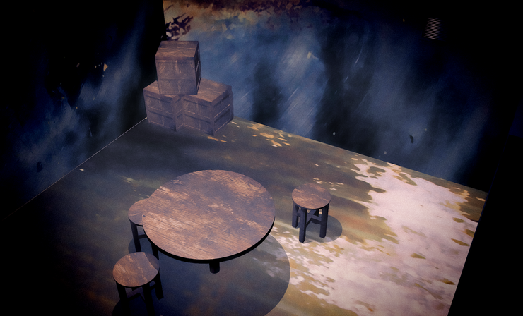

# five colors volunteers 배경 제작기

Team HC 게임에 들어간 배경은 매우 어려운 작업을 거칩니다.

**"대충 하늘 있고, 건물 이따만거 있잖아요. 대충 이해하시죠?"** 라고 대화를 건네면. **"어... 네..."** 하고 배경 원화가 도착하고

여기에 **"20% 정도 더 쿨하게."** 라고 요청하면 최종 배경이 완성 됩니다.

하지만 이번에 발매 될 예정인 Project 7인 FCV는 이 보다 더 빡세게 제작이 되었습니다.

일단 구두로 **"상자 있고요, 좀 어두 컴컴하고요. 의자 있는 거. 대충 이해하시죠?"** 라고 전달을 합니다.

그럼 이런 식으로 배경을 3D로 제작합니다.

물건의 장소, 더불어 물체의 크기를 다시 한 번 조절합니다.

실제 사람이 섰을 때의 위화감이 없는지 다시 한 번 체크합니다.

이후 물체에 텍스쳐를 넣어 봅니다.

위화감이 없으면 좀 더 어울리는 텍스쳐와, 배경에도 텍스쳐를 넣어서 확인합니다.

위와 같이 완성이 되면, 이제 이 이미지는 디자인 팀에게 넘어갑니다.

여기에 필터를 넣어 준 뒤, 좀 더 으스스한 분위기를 만들어 줍니다.

최종적으로 완성 된 배경화면입니다.
