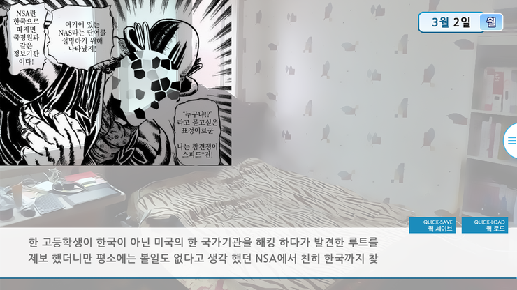

# [저편 하늘을 향해] 참견쟁이 스피드*건 모드를 소개합니다!

**안녕하세요, Team HC 입니다.**

오는 4월을 맞아, **Team HC**에선 아주 특별한 비주얼 노벨을 선보일 예정입니다.

바로바로 [저편 하늘을 향해]의 추가 모드 이야기입니다.

**저편 하늘을 향해는** 2015년에 발매 된 게임으로써 우리들의 날개는 언제부턴가 부서졌다의 정식 후속작인데.

이 게임을 즐김에 있어서 너무 어려운 단어가 많다고 하여, 추가 모드를 선보이기로 했습니다.

그것은 바로 ***참견쟁이 스피드\*건 모드***입니다!

이제 어려운 단어나 문장이 나온다면 스피드\*건이 등장하여 알아서 쓱싹!

***설명을 해 줍니다!***

자세한 설명은 스크린샷을 참조해주세요.

상단 이미지와 같이 참견쟁이 스피드\*건이 글자나 혹은 퀵세이브 버튼을 가릴시에는 터치 - 드래그로 화면을 이동시킬 수 있습니다.

