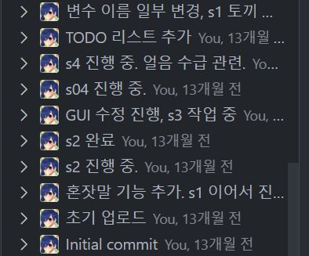
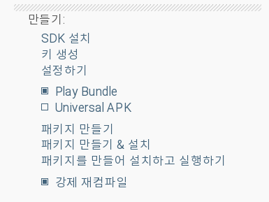
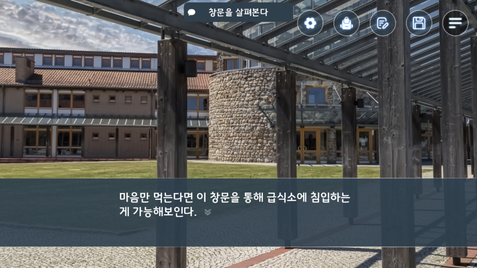

# Project 26 개발일지 1 : Universal APK

**Project 26 - 네가 전력으로 보내고 싶어한다면 (가제)**

​

정말 오랜만에 인사 드립니다. Team HC 입니다.

말도 안되게 늦어지고 소식도 알리지 않아서 다시 한 번 사과를 드립니다.

게임이 완성 되어서 발매에 가까워지면 공지사항을 써야지 생각하고, 그게 지금이 되었습니다.

​

<https://blog.naver.com/team_hc/222931780100>

[**유나 다이어리의 개발을 진행중입니다.**

안녕하세요 Team HC 입니다. 여러가지 개인적인 일들을 마무리 하고 게임 개발을 다시 진행 중입니다. ...

blog.naver.com](https://blog.naver.com/team_hc/222931780100)

더불어 기존에 소개드렸던 유나 다이어리는 내부 사정으로 인해 개발이 임시 중지 되었습니다.

다만 발매를 중단하는 것이 아닌, 좀 더 명확한 플레이 목적이 필요할 것 같아 임시 중단한 것이기에 Project 26을 발매한 뒤에 이어서 개발할 예정입니다. 개인적으로 꼭 내고 싶은 게임이거든요.

​

**ㄱ. 늦어진 이유**

우선 Project 26은 작년 6월 이전부터 개발 되었으며 초기 목표는 2달 안에 완성해서 간단한 게임 (이전에 발매했던 아이오 프린세스와 같이 가벼운 게임)을 만들자가 목표였습니다.

총 10개의 내부 챕터를 가지며 메인 스토리 챕터는 4개 정도로, 플레이 시간은 1~2시간 정도의 짧은 게임이 목표였습니다. (결과적으로 4개의 내부 챕터와 메인 스토리로 이루어질 예정입니다.)

​

다만 개발을 하다 보니 미숙한 스토리가 계속해서 눈에 밟혔고, 짧게 진행 되는 내부 챕터는 플레이를 해도 재미를 느끼기엔 어려움이 많다고 (개인적으로) 판단해 수정을 하고, 그게 벌써 13개월이 되었습니다.

많이 기다리신 여러분들께도 죄송하며, 긴 시간 동안 기다리게만 한 원화가께도 다시 한 번 사과를 드립니다.

​

본래의 개발 방향성과는 많이 달라졌지만, 이전보다는 확실히 스토리를 따라 진행하면서 느낄 수 있는 재미가 있다고 판단되어 고도화 작업에 있습니다.

어떤 식으로 게임이 진행 되는지, 어떤 등장 인물이 등장하는지는 추후 개발일지에서 공개하도록 하겠습니다.

​

**2. Universal APK?**

사실 무슨 말인지 아직도 잘 모르겠습니다. 아무튼 Universal APK로 추출을 해보니 실행이 안됩니다.

본래 저는 모든 장비가 윈도우 + 안드로이드 조합이었으나, 최근 맥북 + 아이폰 조합으로 개발 환경이 변경 되어, 테스트도 아이폰으로 진행하고 있었습니다.

iOS 발매도 염두해 두고 있었기에 문제 없이 개발하고 있었으며, 문제가 없는 이상 iOS (아이폰 + 아이패드)로도 발매가 될 것으로 보이는데요.

​

개인 사정으로 여러 물건들을 매매하고, 다시 갤럭시 S22를 구매하고 오늘에서야 안드로이드 빌드 작업에 들어갔는데 실행이 안됩니다.

기존에 개발 했던 게임은 모두 실행이 되는데, Project 26만 실행이 안되니 원인을 모르겠습니다.

(실행은 되나, 설정하지 않은 Menu가 표시 되고 배경음악만 흘러나오다 꺼짐. 로그에도 찍히지 않음.)

​

RAM도 조절해보고, 내부에 있던 camera 설정, 새로 추가한 함수도 건드려봤지만 안됩니다.

다만 구글 플레이에서 지원하는 Play Bundle에서는 정상 실행이 되어서 다행이긴 한데, 안드로이드는 특유의 파편화가 심한 OS다 보니 디바이스에 따라 지원이 안될 가능성도 있지 않을까 걱정이 됩니다.

​

이 오류로 인해 구글 플레이 외에서는 서비스가 불가능합니다.

**​**

**3. 개발 상황은?**

원화는 모두 완성 된지 정말 오래 되었으며, 내부 시나리오의 고도화 작업만 남은 상황입니다.

본래는 7월에 발매할 생각이었지만 최근 개인적으로 정말 곤란한 일이 있어 아직까지도 처리를 하지 못해, 계속 늦어지고 있습니다.

​

다만 여러분들께 소개하기엔 충분히 완성이 되었기에 소개와 같이 개발을 하면 좋을 것 같아 개발일지를 틈틈히 진행하려고 합니다.

지금까지 기다려주셔서 다시 한 번 감사드리고, 그럼에도 불구하고 꾸준히 후원해주신 분들께도 다시 한 번 감사를 드립니다.

​

​

다음 개발 일지는 어떤 게임을 개발하려고 했는가? 로 이어집니다.
