# Project 26 개발일지 2 - 어떤 게임을 만드려고 했었나?

**ㄱ. 아쉬웠던 점**

비주얼 노벨을 개발하면서 아쉬웠던 점은, 시나리오 내에서 좀 더 자유로운 활동이 불가능 한 점이 항상 마음에 걸렸습니다.

시나리오를 읽고 진행하며 선택지를 고르는 것이 당연하고, 그런 방식이 플레이어에게 즐거움을 줄 것이라고 생각했지만, 이제는 그 틀에서 벗어나고 싶었습니다.

[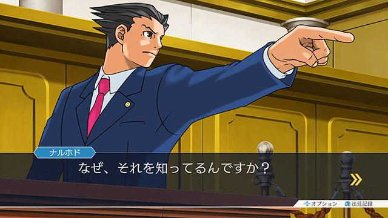](#)
[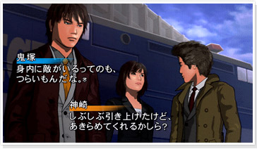](#)

개인적으로 재미있게 플레이 한 게임을 손꼽자면, '역전재판'과 '총성과 다이아몬드' 입니다.

'역전재판'의 경우, 시나리오를 읽고 진행하며 선택지를 고르는 것뿐만 아니라, 추리를 위해 탐색을 하고 자료를 수집하여 재판에서 승리하기 위해 올바른 선택지를 판단해 선택해야 합니다

'총성과 다이아몬드'는 시나리오를 읽고 진행하며 선택지를 고르지만, 짧은 시간 내에 선택지를 결정해야 하는 특징이 있습니다.

​

이런 요소들에서 아이디어를 얻어, '유나 다이어리'를 개발할 때 자료 수집과 선택지의 시간 제한을 넣는 형태로 게임을 만들었으나, 그 양을 감당하기 어려워 일시 중지하게 되었습니다.

이후 처음부터 제대로 된 틀을 잡고 시작하여 개발하게 된 게임이 현재의 "네가 전력으로 보내고 싶어한다면 (가제)"입니다.

​

[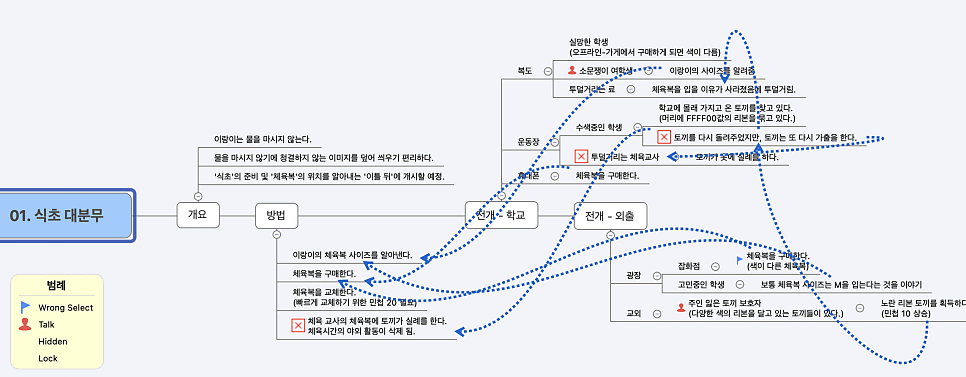](#)

이런 식으로 11개의 챕터를 기획

**23년 4월**, 확실한 기획이 필요하다고 생각하여 프로젝트의 기획을 먼저 세웠습니다, 이 기획을 바탕으로 게임을 개발했지만, 플레이하면서 어색하거나 억지스러운 부분이 계속 눈에 띄어 수정을 거듭하게 되었습니다.

결과적으로 초기 기획과는 많이 다른 형태로 진행되었습니다.

​

처음 구상한 내용은, 시간이 진행됨에 따라 랜덤으로 이벤트가 발생하고, 각 이벤트가 일정 기간 내에 해결되지 않으면 엔딩이 발생하는 시스템이었습니다.

주인공에게는 '아이오 프린세스'와 같은 스탯 개념이 부여되었고, 스탯과 소지금을 관리하지 않으면 이벤트 해결이 어려웠습니다.

그러나 직접 네가 전력으로 보내고 싶어한다면 (가제)을 진행 해보니 난이도가 너무 높아, 스탯과 같은 요소는 모두 가방 시스템으로 이관되었습니다.

[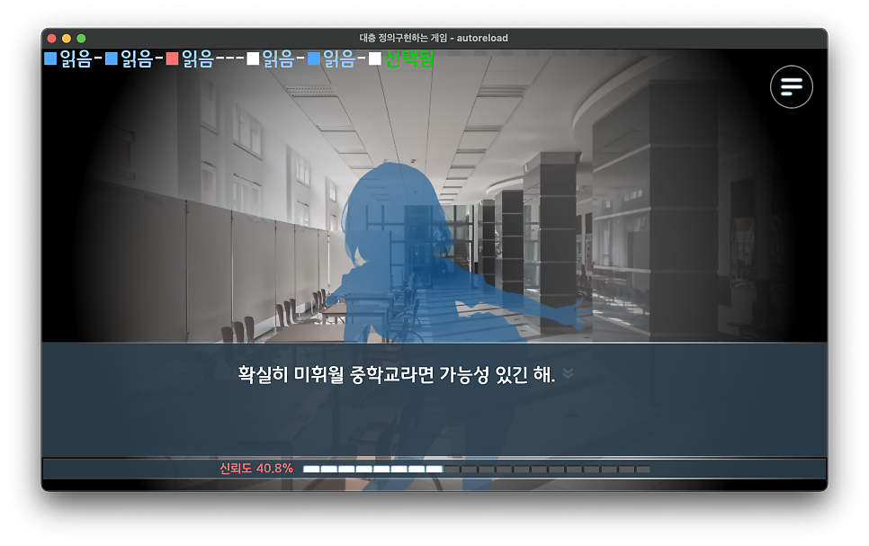](#)

네가 전력으로 보내고 싶어한다면 (가제)의 설정이 확실시 된 것은 24년 2월로, 이 때의 모든 시스템이 정립 되고 시나리오의 고도화 작업을 진행하고 있었습니다.

폐기할 시스템을 폐기하고, 몇몇 시스템은 배열로만 처리하기에는 다소 문제가 있어서. 써본 적이 없어서 어색한 클래스를 써보기도 하구요.

​

​

**ㄴ. 게임 시스템에 대해**

[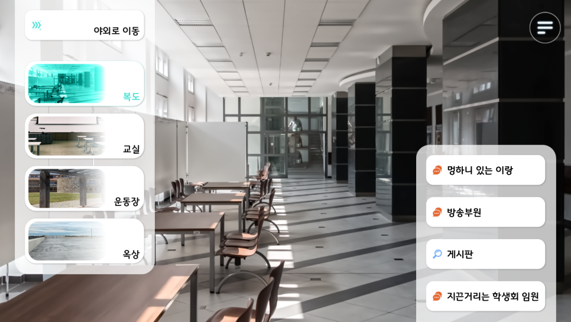](#)

게임 시스템의 메인이 되는 미휘월 중학교의 모습입니다. 주인공은 미휘월 중학교에서 발생하는 특정 사건을 해결 하기 위해 움직입니다. 실내에서 활동할 수도 있고, 상황에 따라 야외로 이동해야 할 수도 있습니다.

모든 챕터에서 등장하는 이랑이와 방송부원은 뒤로 하고 첫 번째로 학생회 임원을 만나보려고 합니다.

​

[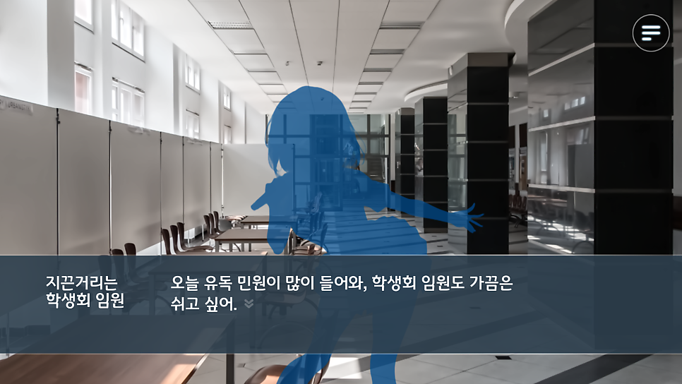](#)
[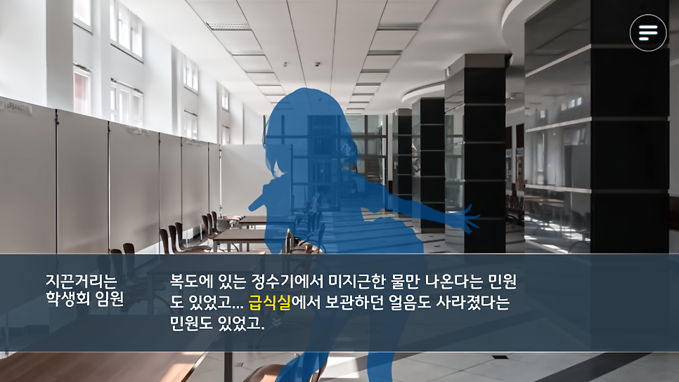](#)

이미지는 실루엣으로 들어갈 예정이지만 임시 이미지입니다,

학생회 임원은 민원 때문에 곤란한 것 같습니다. 급식실에서 무슨 일이 발생한 것 같기도 합니다.

이런 식으로 미휘월 중학교에서 만나는 상대방은 곤란하거나 원하는 것이 있으며, 사건의 실마리가 될 수 있으므로 얻을 수 있는 정보는 최대한 얻어봅니다.

​

[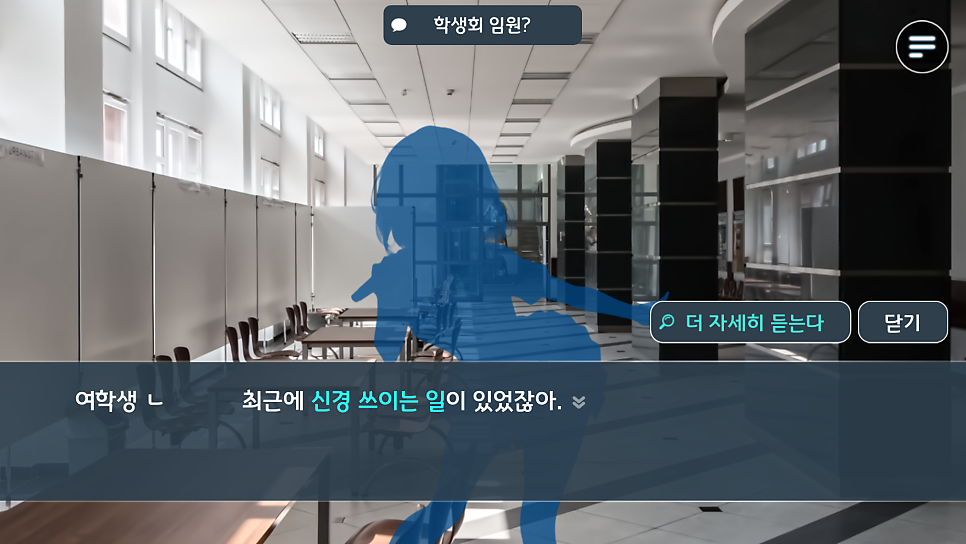](#)
[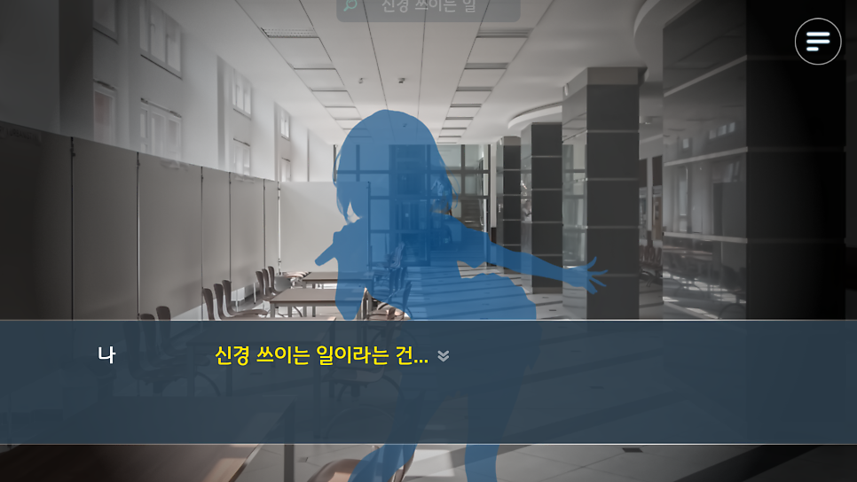](#)

그 중 특별한 문장은 "더 자세히 듣는다"를 이용해서 자세히 들어볼 수 있습니다.

자세히 듣기를 누르면 특수 효과와 함께, 그 문장에 대해 더 자세히 들어볼 수 있습니다. 이것으로 실마리를 더 얻을 수도 있으며, 게임과는 상관 없는 정보를 얻을 수도 있습니다.

​

[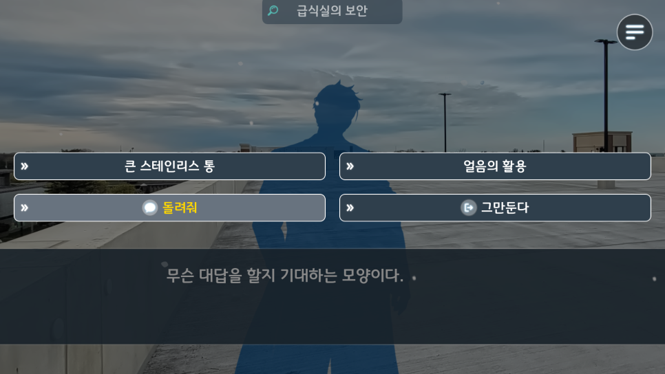](#)

이미지는 실루엣으로 들어갈 예정이지만 임시 이미지입니다,

옥상으로 이동하니 사건의 원흉으로 보이는 상대가 있습니다.

이 상대와 대화를 해서 설득을 하면, 사건을 해결 할 수 있어 보입니다.

​

[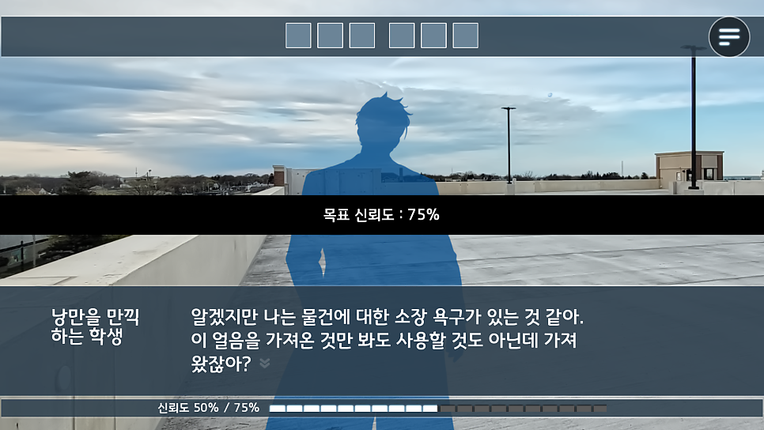](#)
[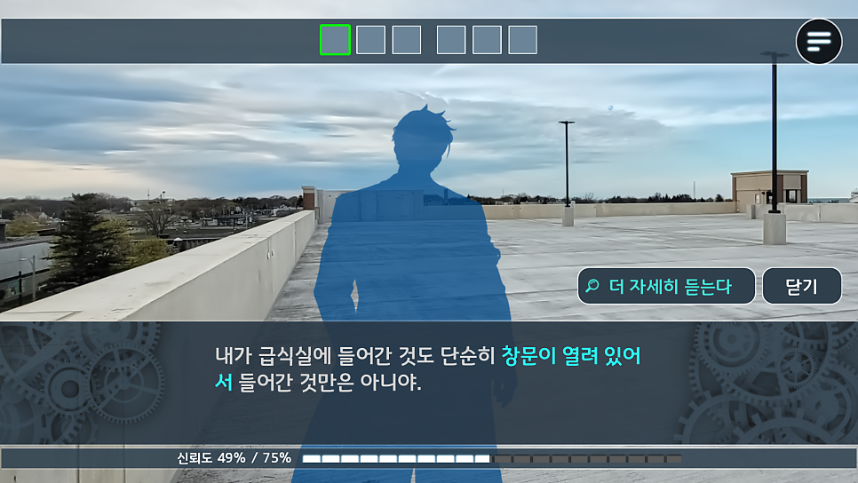](#)
[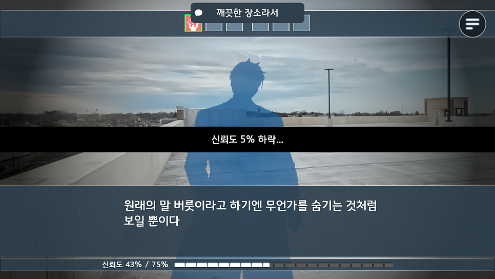](#)

대화를 들으며 상대방의 비위를 맞춰주면서 신뢰도를 쌓으면 됩니다.

신뢰도는 시간이 흐름에 따라 감소하기 때문에, 짧은 시간 내에 내용을 파악해서 선택지를 선택해야 합니다.

​

**ㄷ. 진행 상황**

현재 진행 중인 부분은 직접 플레이 해보며 부족한 부분을 채워나가고 있으며,

이후로는 실루엣 이미지 제작 -> UI 이미지 다듬기 -> 업적 시스템 -> Android에서 실행 안되는 거 해결하기 위해 처음부터 다시 만들기 입니다.

많이 남은 것 같지만, 어떻게든 될 것 같습니다

​

​

다음 개발 일지는 미휘월 중학교에는 어떤 일이 있었는가? 로 이어집니다.
