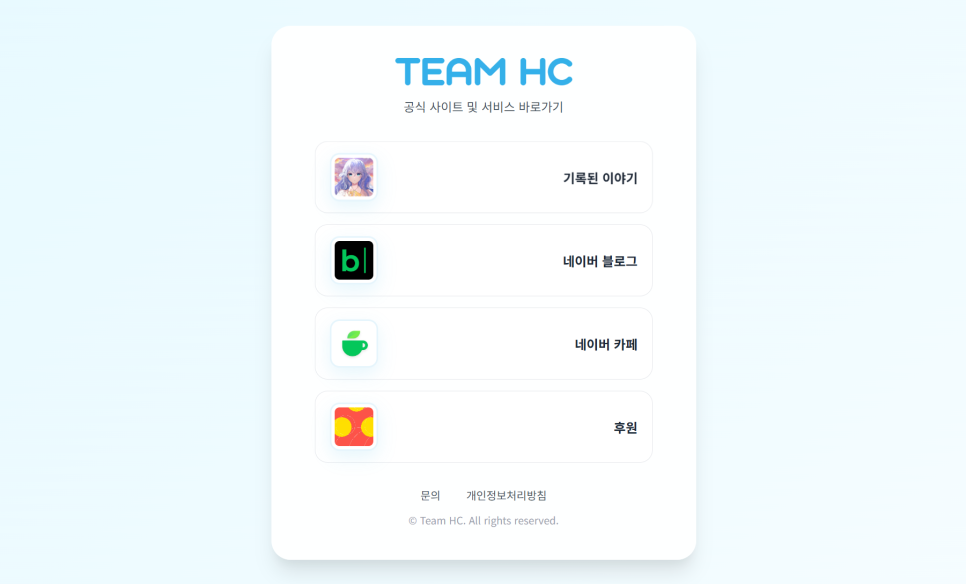
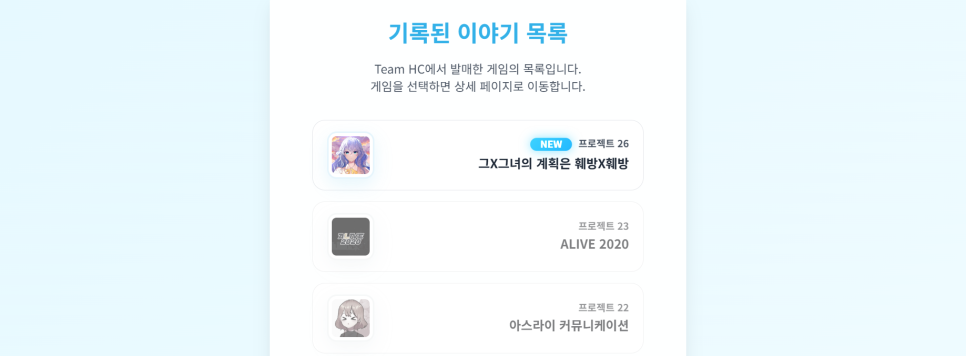
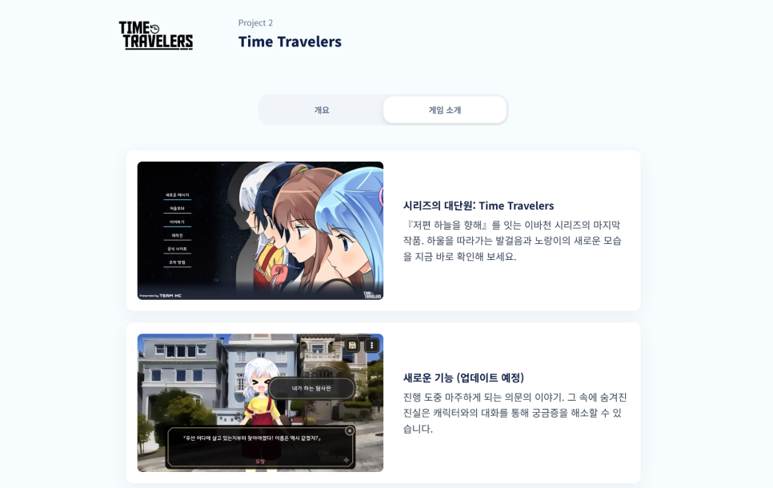
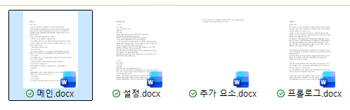
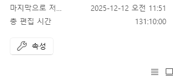
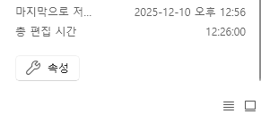

# 공식 홈페이지가 개설 되었습니다

안녕하세요, Team HC 입니다.

**​**

원래부터 홈페이지를 운영하고 싶었지만 웹페이지 작성에 대해 자세히 아는 것도 아니며, 과거에는 서버가 필요해서 24시간 내내 켜놓을 수 있는 환경까지 마련하긴 힘들 것 같아 거의 포기했었는데, 요즘은 간단하게 만들 수 있는 방법이 정말 많았습니다.

그 중 구글 홈페이지를 이용해서 만드는 방법을 이용해서 운영을 하다, 직접 운영할 수 있는 방법을 찾아 드디어 공식 홈페이지를 개설하게 되었습니다.

​

아직 모든 프로젝트의 설명이 완성된 것은 아니지만. 시간이 날 때마다 차근차근 완성해 나가려고 하고 있습니다.

​

원래는 구 프로젝트 같은 경우에는 과거에 홈페이지를 운영할 때 만들었던 사이트 그대로 가져와서 서비스하고 싶었지만, 과거 HDD로 백업을 하면서 만들 당시에 소스 코드를 제외한 모든 디자인 파일들을 분실해버려 복구할 수 있는 방법이 없었습니다.

미궁 당시의 홈페이지와 게시판 DB, 그리고 프로젝트 4, 5, 6의 홈페이지의 내용이 분실 되었습니다.

혹시나 가지고 계신 분은 없으시겠지만. 구 사이트의 소스 코드나 이미지를 가지고 계신 분은 공식 이메일로 보내주시면 정말 감사하겠습니다. (\_\_)

​

Time Travelers의 항목을 확인하면 기존의 게임과는 다른 모습인데요. 본래 작년 7월에 15주년 기념으로 업데이트 하여 공개하려다가 계속해서 늦어져서 일부만 완성된 상태입니다. 현재는 '엔트로피가 증명하는 그녀의 부재(가제)' Project 18을 계속해서 개발 중인데요, 게임 내에 들어갈 꽤 중요한 '미니 게임'에 대해 계속해서 안을 내다 보니 늦어지고 있습니다. 시나리오는 어느 정도 완성이 되었고, 이제 스크립트 작성 단계다 보니 조만간 게임에 대한 소개가 가능할 것 같습니다.

​

엔트로피가 증명하는 그녀의 부재(가제)' Project 18 입니다.

​

웹페이지를 만들면서 PNG의 압축률이 생각 이상으로 좋지 않은 걸 확인했는데요. Webp로 변환하니 정말 빠르더라고요. 그런데 Ren'py에서도 지원이 되는 모양입니다. 게다가 음원 파일도 Opus도 지원을 하더라고요. 압축을 풀 때는 다소 느려지지만 용량 확보에서는 정말 큰 이득을 볼 수 있기에 기존 게임도 모두 Webp와 Opus로 변환 시켜서 업데이트를 할 계획을 가지고 있습니다. Android의 보안 정책 때문에 조만간 렌파이로 제작된 게임을 모두 업데이트 해야 하기 때문에 다소 손 볼 수 있는 부분과 함께 일괄 업데이트 할 계획입니다.

​

본래는 Webp나 Opus 같은 확장자는 느린 속도, 게다가 과거에는 렌파이를 모바일로 돌리는 것 자체가 너무나 힘겨웠기 때문에 넣는 것을 망설였던 것 같은데 지금 같은 환경에서는 오히려 적극적으로 사용하는 게 좋을 것 같습니다. 특히 최근의 발매한 '그X그녀의 계획은 훼방X훼방'은 1080p 해상도로 서비스 하면서 게임 자체의 용량이 너무 커졌거든요 (300MB 이상)

​

​

홈페이지 같은 경우에는 과거 서비스했던 배경화면이나 (블로그에 파편화 되어있어서 보기가 힘들죠) 개발 단계의 스크린샷 같은 것도 추가적으로 공개하려고 하고 있으며, 적어도 게임 내 소개가 모두 완성 되고 난 뒤에 업데이트 할 계획입니다. 그 외에도 블로그 게시물도 좀 더 홈페이지에서 보기 편하게 만들고 싶은데 이건 쉽지 않을 것 같네요.

​

​

2026년 새해가 밝았습니다. 모두 새해 복 많이 받으세요.

이번 올 봄에는 적어도 **'엔트로피가 증명하는 그녀의 부재(가제)' Project 18**와 **'Time Travelers' Project 2**의 소식을 들고 오겠습니다.

​

[**http://teamhc.net/**](http://teamhc.net/)

[**Team HC**

공식 사이트 및 서비스 바로가기 기록된 이야기 네이버 블로그 네이버 카페 후원 문의 개인정보처리방침 © Team HC. All rights reserved.

teamhc.net](http://teamhc.net/)

​

​
