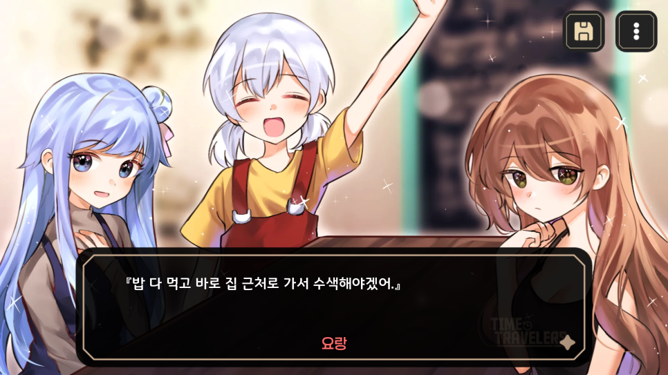
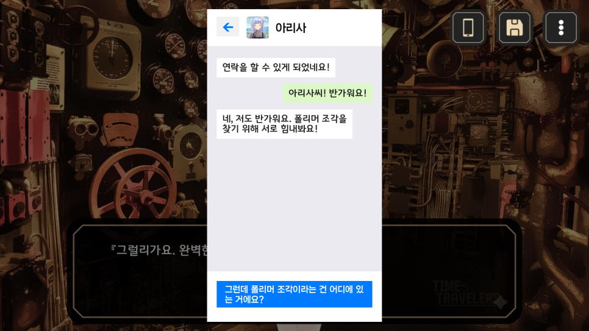
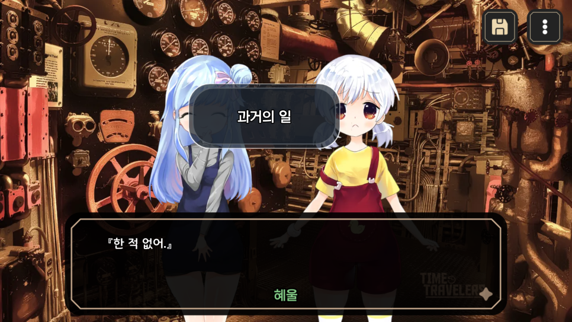
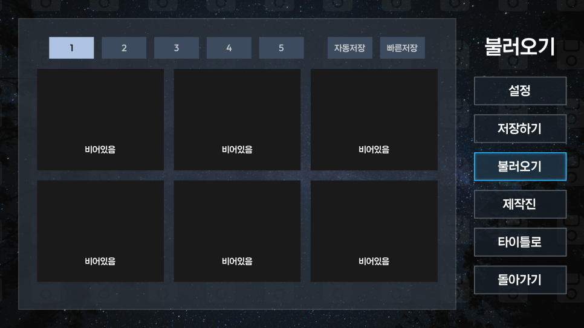
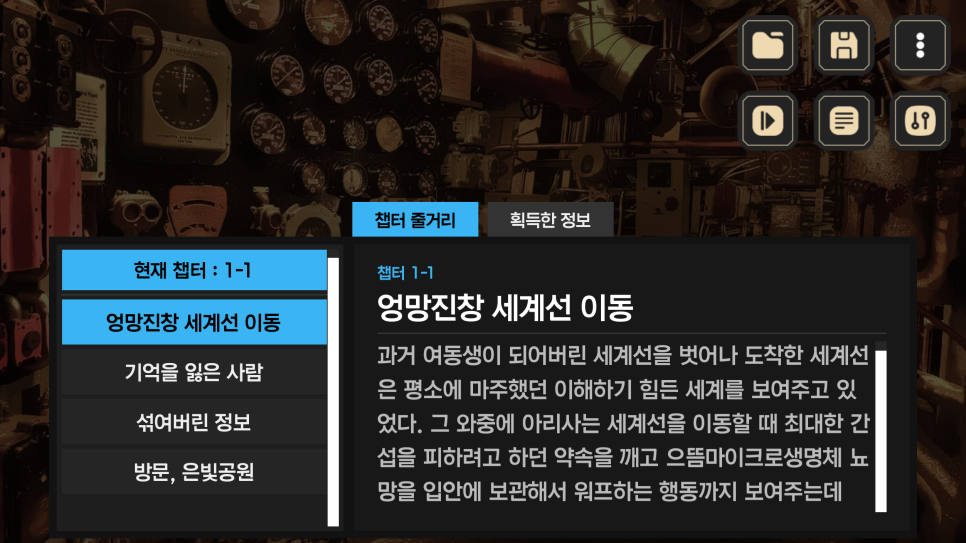
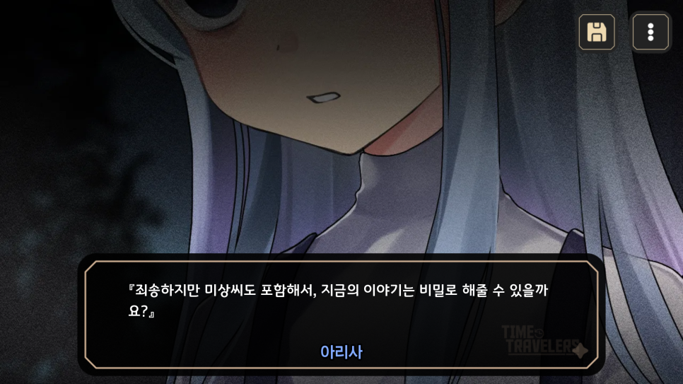

# 프로젝트 2 - Time Travelers 재개발 일지 01

**안녕하세요, Team HC 입니다.**

**​**

과거 발매했던 Time Travelers은 이바천 시리즈의 큰 줄기를 담당하고 있는 프로젝트인데요, 추후 발매 예정인 "프로젝트 15 - 과거 재생 장치(가제)"와 "프로젝트 18 - 엔트로피가 증명하는 그녀의 부재(가제)"에 영향이 있는 프로젝트기에 어느 정도 손을 볼 필요가 있다고 생각했습니다.

그 뿐만이 아닌 현재 공개된 다양한 프로젝트가 미완성인 채 공개되어있는 작품이 많기에 대부분 손을 볼 예정입니다. (순차적으로 진행 될 예정)

​

앞으로의 발매 계획을 알려드립니다.

​

**2026년 예정**

프로젝트 2 - Time Travelers (# 3월 예정)

프로젝트 18 - 엔트로피가 증명하는 그녀의 부재(가제) (# 하반기 예정)

프로젝트 15 - 과거 재생 장치(가제) (# 하반기 예정)

​

**2027년 예정**

프로젝트 4 - 우리들의 날개는 언제부턴가 부서졌다 EP6 (완결)

...

새로운 일러스트도 추가 될 예정

본래 미완성된 부분을 다듬고, 최신 렌파이 버전에만 대응하려고 했으나 추후 발매될 프로젝트를 담당해주실 일러스트레이터님이 도와주셔서 다양한 일러스트가 추가 되었습니다. 추가적인 장면도 있으며 내용도 많이 보강되었습니다. 특히 프로젝트 4 - 프로젝트 6으로 이어지는 '이바천 시리즈'나 프로젝트 18 - 프로젝트 15로 이어지는 '시리즈'의 큰 줄기 역할을 하고 있는 프로젝트기에 많은 신경을 썼습니다.

​

레거시 모바일이 모두 대체 될 예정

기존에 등장했던 통화 장면이 메시지로 대체가 됩니다. 모바일 기능은 현재 메시지를 받거나 답장만을 보낼 수 있으며, 프로필 사진의 경우 특수 선택지를 선택해야만 해금할 수 있습니다. 추가되는 내용에 대응하는 선택지므로 대부분 쉽게 해금할 수 있습니다. 특정 장면에서는 메시지를 꼭 확인해야만 진행할 수 있지만, 대부분 잡담이기에 무시하고 진행해도 되는 부분입니다.

​

어려운 정보는 팝업 시스템으로

이번 프로젝트를 재개발하며 중점으로 준 사항은 기존 문제되는 부분은 최대한 건드리지 않는 것입니다. 프로젝트 4의 우리들의 날개는 언제부턴가 부서졌다의 경우, 당시 미숙했던 문장을 최대한 제거했지만 오히려 2012년의 낡은 맛이 대부분 사라졌다고 생각했습니다. 이도저도 아니게 할 바엔 기존의 시나리오를 최대한 건드리지 않고 (그래도 많이 건드리긴 했습니다.), 대신에 꼭 넣어야 할 것 같은 설명은 추가적인 팝업으로 대체되어 등장합니다. 팝업 시스템은 무시하고 진행해도 되지만, 프로젝트 4 - 프로젝트 6의 내용이 기억나지 않는다면 팝업 시스템이 도움이 될 것입니다.

​

다듬어진 세이브 슬롯

기존 세이브는 모두 호환되지 않습니다. 이유는 변수가 대부분 변경 되어 기존 세이브와 호환이 되지 않는 것인데요. 유일하게 살아남은 변수는 모두 클리어했을 때의 특전 시스템입니다. 기존 혜울이 등장해서 다양한 정보를 주던 '새로운 메시지' 기능은 기존에 클리어 한 유저도 볼 수 있습니다. 다만, 새로운 메시지 기능의 내용은 많이 대체가 되었습니다. 게임 내의 변수를 대부분 변경한 이유는 기존 렌파이의 소스 코드를 대부분 들어내고 라이브러리를 새로 만들었기 때문인데요. 성능적으로도 빨라지고, 소스코드의 크기도 많이 낮아졌습니다. 추후 업데이트 될 레거시 프로젝트의 개발에도 도움이 될 것입니다.

추가적으로 게임 내의 이미지가 PNG에서 WEBP로 대체 되었습니다. 덕분에 게임을 좀 더 낮은 용량으로 개발할 수 있었습니다.

​

더불어 저장하기/불러오기 기능의 썸네일이 커져서 보기가 편해졌습니다. 대신 슬롯은 5x6 개로 줄어들었는데요. Time Travelers는 크게 불편하지 않을 거라 생각하지만 분량이 길어지는 프로젝트 4 - 우리들의 날개는 언제부턴가 부서졌다를 제외하고는 다른 레거시 프로젝트도 모두 5x6으로 고정 될 예정입니다. 추후 발매될 프로젝트 18은 프로젝트 26 - 그x그녀의 계획은 훼방x훼방과 동일하게 갈 예정입니다.

​

고민중인 기능

디버그를 하면서 추가한 기능이 몇 가지 있는데요. 챕터 줄거리 기능은 아직도 게임 내에 넣을지 고민중입니다. 각 챕터별로 스토리가 요약되어 있어서 챕터에 도달할 때 간단하게 내용을 요약해서 볼 수 있는데요, 장단점이 있는 기능이라 아직도 내부 회의 중에 있습니다.

​

많은 기대 해주세요

프로젝트 2 - Time Travelers의 업데이트는 3월 중에 계획중이며, 현재 마무리에 있습니다. TT를 재미있게 플레이 해주셨던 분은 꼭 한 번 플레이 해주시고, 추후 발매될 프로젝트가 기대되는 분들도 연관이 있는 프로젝트이기에 꼭 한 번 플레이를 해주셨으면 좋겠습니다.

​

감사합니다.
