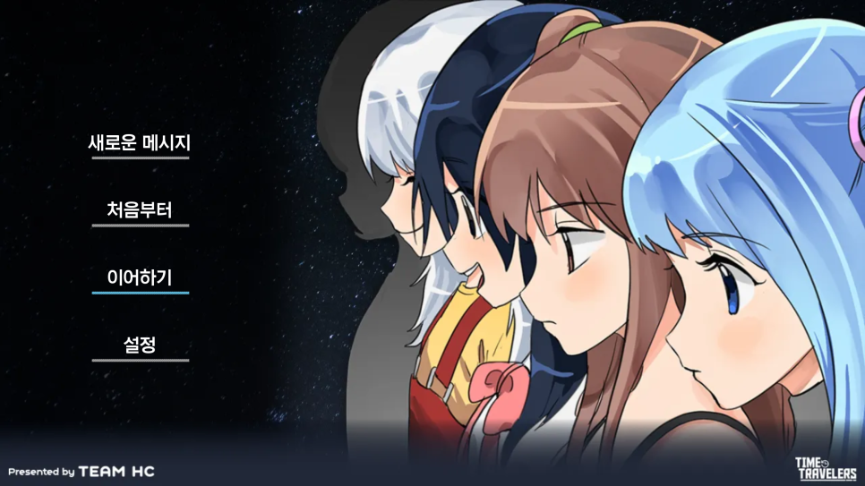
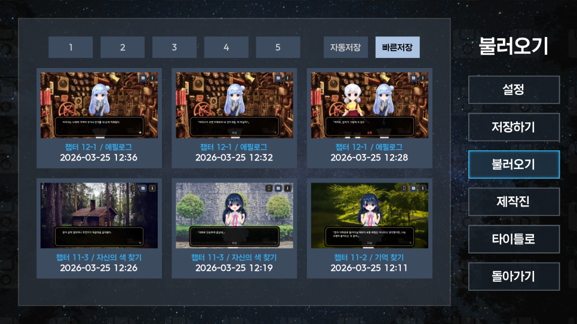
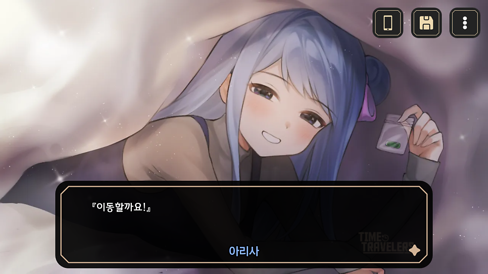
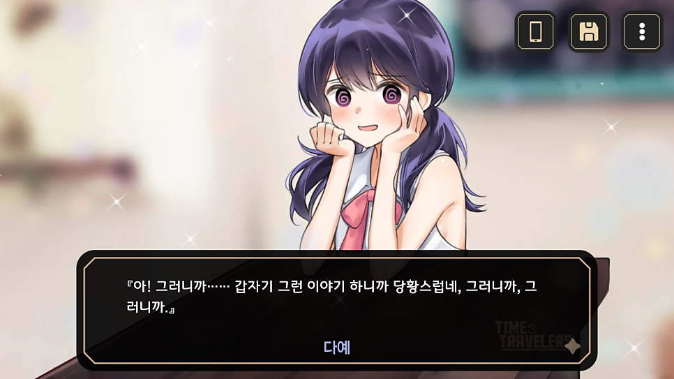
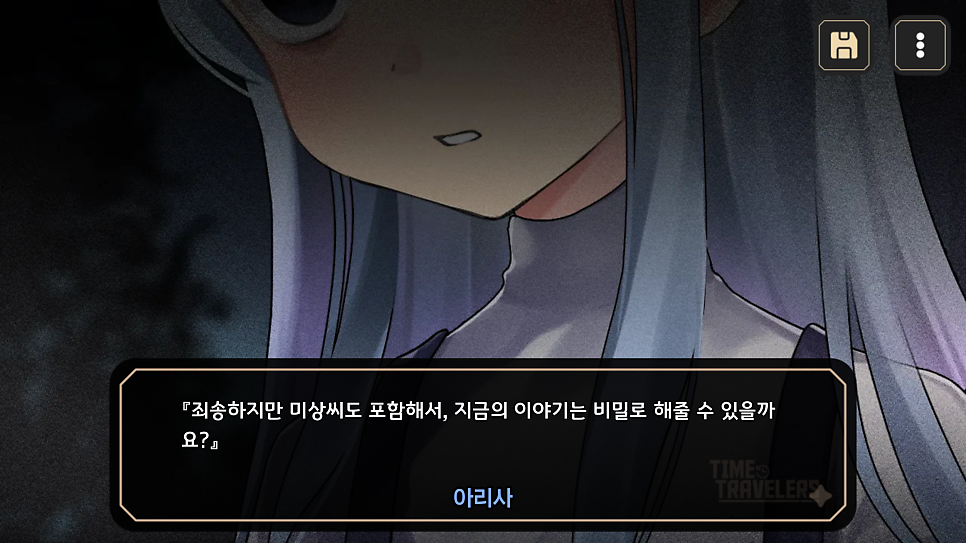
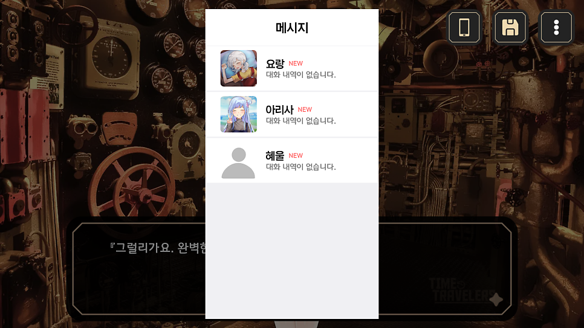

# Time Travelers의 업데이트가 공개 되었습니다.

​

2017년에 발매하였던 Time Travelers 입니다.

이바천 시리즈의 제일 중요한 뼈대를 맡고 있기에, 어느 정도 보안도 필요해서 업데이트 계획을 잡던 도중,

일러스트를 도와주실 수 있는 분을 알게 되어 조금 더 볼륨감 있게 업데이트 할 수 있었습니다.

​

추후 발매할 프로젝트 15, 프로젝트 18과도 연관이 있는 만큼 신경 써서 업데이트 하였습니다.

이전에 재미있게 플레이 하셨던 분은 한 번 더 플레이 해주시면 감사합니다.

​

​

저장하기/불러오기 부분은 좀 더 보기 편하고, 선택하기 편하게 변경 되었습니다.

큰 썸네일과 챕터 부분도 표시가 되어 조금 더 편하게 확인할 수 있게 되었습니다.

​

다만 기존 세이브 파일과는 호환이 되지 않기에, 새롭게 플레이를 해야 합니다.

​

​

이벤트 CG도 많이 업데이트 되었는데요, 이 뿐만 아니라 추가된 씬도 부분적으로 있습니다.

​

​

메시지 기능입니다. 프로필 사진은 플레이를 할 때 자연스럽게 해금을 할 수 있습니다.

대부분은 잡담이지만 진행을 하기 위해서 꼭 확인해야 하는 메시지도 있습니다.

메시지가 도착할 때 굳이 기다리지 않더라도 하단 화면을 연타하면 스킵해서 보실 수 있습니다.

​

​

최대한 여러번 플레이하였지만 미처 발견하지 못한 버그가 있을 수도 있으니,

버그를 발견하시게 되면 공식 이메일로 꼭 제보 부탁드립니다. (teamhc.ko@gmail.com)

​

감사합니다.

​

​
