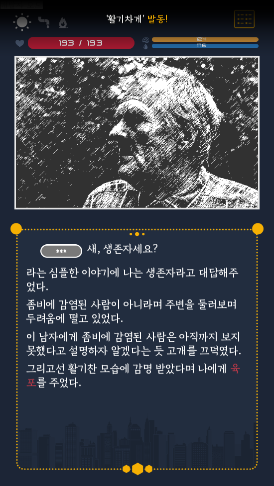

안녕하세요, Team HC 입니다.
오는 4월 5일 업데이트 되는 개선 및 변경 사항에 관한 안내입니다.
엔딩 15, 16, 17, 18이 추가 됩니다.
- 접두어 "배부르게" "신비롭게"가 추가 됩니다.
- 접미어 "섬세한" "인자한"이 추가 됩니다.
​
신규 아이템 붕대가 추가 됩니다. 체력 회복에 사용할 수 있습니다.
경험치를 사용할 때 1씩 사용되던 부분이 5씩 사용되며, 5 미만일 때는 1씩 사용됩니다.
눈물의 사용 방법이 변경 되었습니다. 랜덤으로 사용되며 능력치는 2~3 랜덤으로 적용 됩니다.
수정의 사용 방법이 변경 되었습니다. 접두/접미 구분 없이 랜덤으로 획득 됩니다.
​
현재 진행 되고 있는 루트를 확인하기 위해 진행 되고 있는 n일차 화면에서 페이즈가 표시 됩니다.
​
엔딩 3, 엔딩 4에 진입이 불가능 한 버그가 수정 됩니다.
엔딩 3의 난이도가 다소 완화 됩니다. (50% 이벤트 시작 -> 75% 이벤트 시작)
엔딩 4의 난이도가 다소 완화 됩니다. (김장 횟수 3회 -> 2회)
엔딩 10의 난이도가 다소 완화 됩니다. (감염 상태 10일 -> 8일 유지)
​

4.4 16:08 추가
- 특정 접두어/접미어를 사용할 시에 일부 이벤트에서 특별한 효과가 발생합니다.
- 몇몇 이벤트에 선택지가 추가 되었습니다.