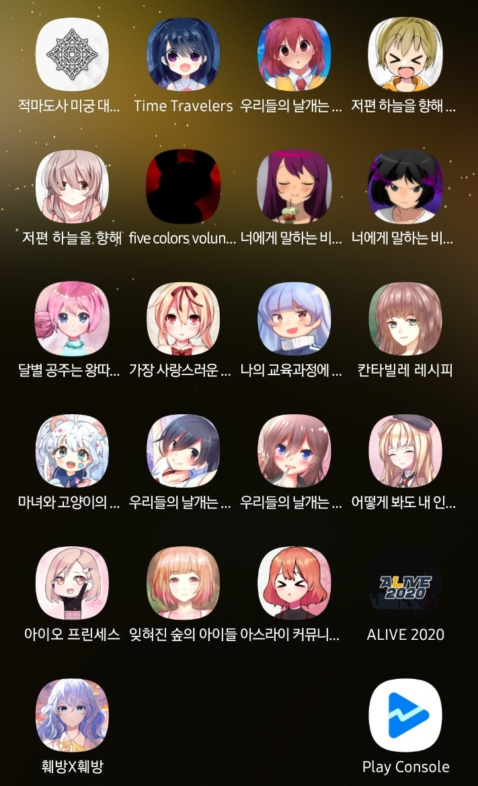

*대부분의 게임이 최신화 되었습니다.*
## 인사말

안녕하세요, Team HC 입니다.
​
Ren'py로 개발 된 게임을 모두 최신화 하며, 기존 Artemis 엔진으로 개발 된 게임도 최신화 하고 싶었습니다.
이 당시 개발했던 게임은 엔진 사용에 있어 다소 문제가 있다고 판단한 부분이 있어, 업데이트를 중단하는 방향으로 잡았으나 최근 이 문제가 해결 된 걸 확인하고, 사용에 문제가 없는 것을 확인하고 업데이트를 재개하였습니다.
게임 내의 차이점은 공식 사이트 링크가 생겼다 정도
수정 사항은 크게 없으며 그 당시 해결하지 못했던 버그 수정, 공식 사이트 표기 변경 정도입니다.
​
​
## 문제점

엔진의 변경 사항 중에 큰 지장이 있는 것은 없었지만 예측도 못한 오류가 발생할 수 있습니다. 이 부분을 다듬었지만 부족한 부분이 있을 수 있습니다. 플레이에 있어 문제가 발생할 경우 문의를 참고해주세요. (바로가기)
​
변경 사항 중, 구글 플레이에 업로드 하는 것 자체가 문제가 된 사항이 있었으나. 일단 해결 되었습니다.
두 번째로는 인앱 결제 모듈의 변경 사항입니다. 작동을 시켜본 결과 정상적으로 작동을 하나 만에 하나 문제가 발생할 경우 게임 내의 인앱 결제를 삭제하는 방법도 고려하고 있습니다.
​
​
## 업데이트 되는 게임

Project 6 - 저편 하늘을 향해 EP0
Project 7 - five colors volunteers
Project β - 너에게 말하는 비밀 (상 / 하)
Project 9 - 달별 공주는 왕따당하지 않아.
​
업데이트 시기는 오는 3월 6일 너에게 말하는 비밀을 선 업데이트 한 후
3월 9일 일괄 업데이트 할 예정입니다.
​
업데이트 거부로 인해 예정 일자에 업데이트가 불가능한 상황입니다. 지속적으로 수정하여 재검토 업데이트 신청 중입니다.
​
너에게 말하는 비밀 - 상 편이 우선 업데이트 되었습니다.
3월 10일 일괄 업데이트 될 예정입니다.
​
업데이트 완료되었습니다.