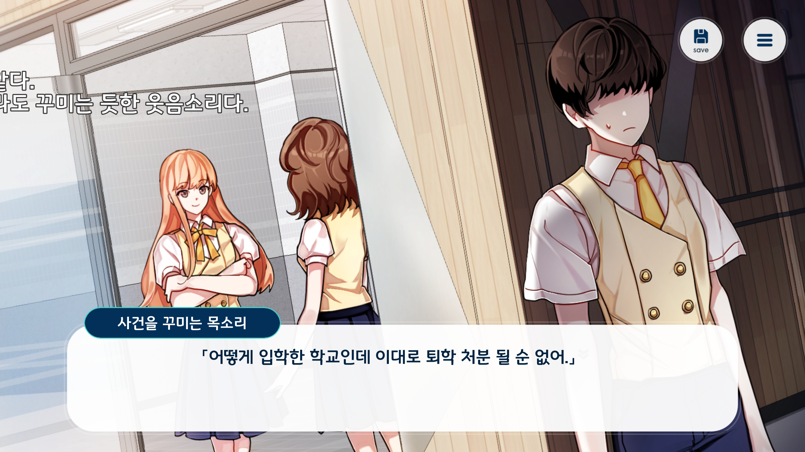
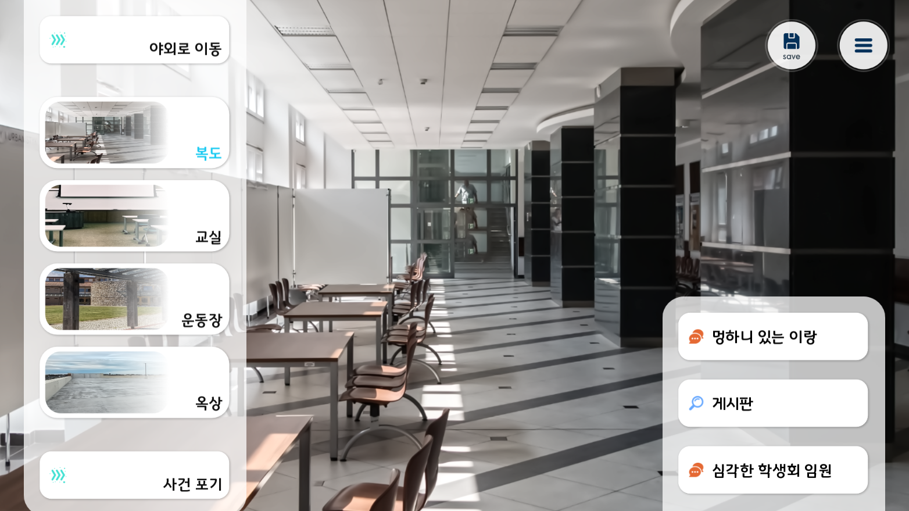
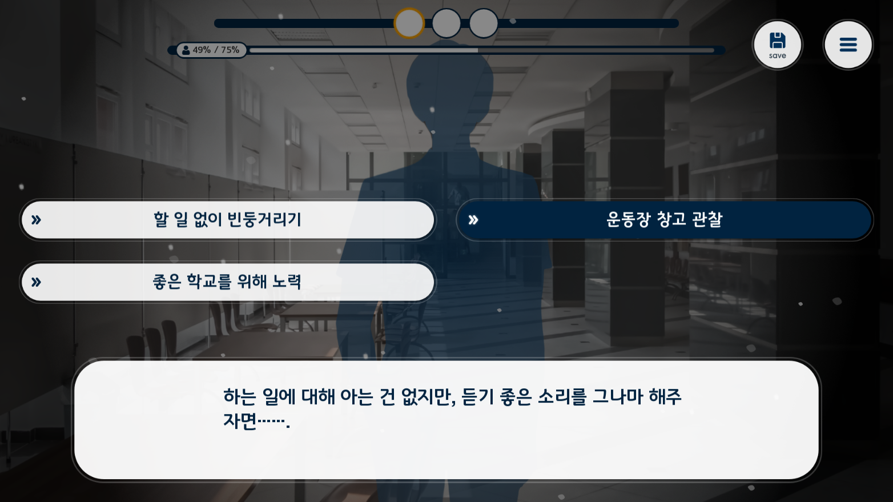
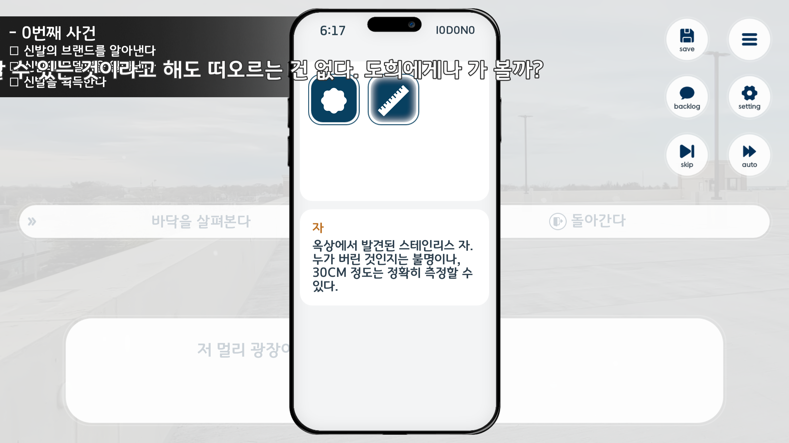
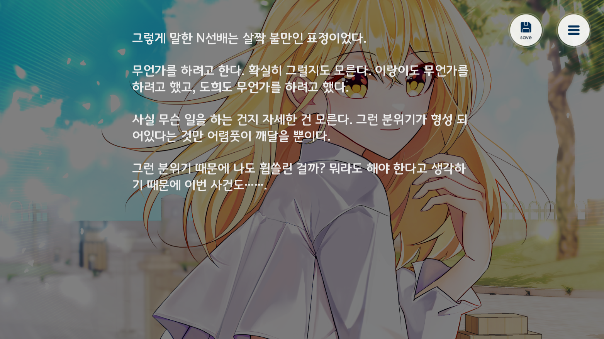
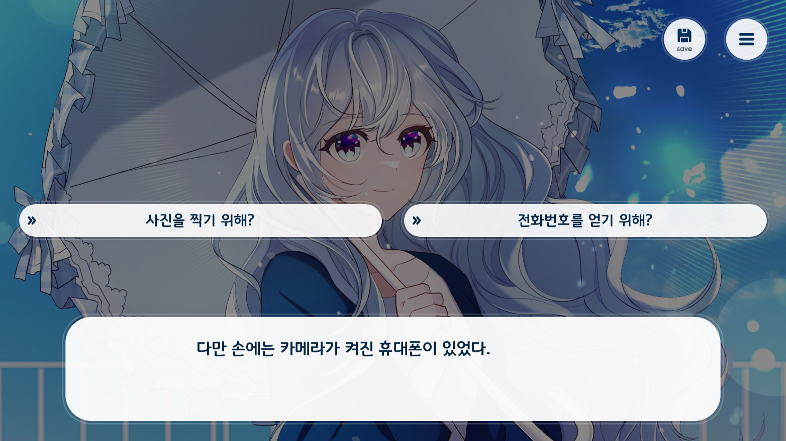

Project 26 - 그X그녀의 계획은 훼방X훼방
발매일 : 2025년 2월 24일
가격 : 3,200원
​
(구글 플레이 바로가기)
​
발매 기종 : Android
​
​
평범하지 않은 학교에 다니는 그, 하지만 복도에서 수상한 계획을 엿듣게 된다.
학생회장이 되기 위해 다른 학생회장 후보를 괴롭힌다고 하는데, 왜 하필 내가 아는 사람인 걸까?
큰일을 만들고 싶지 않은 나는 조용히 해결해보려고 시도 하는데...
​
해당 링크에서도 확인 가능합니다. (바로가기)
​
​
## 소개에 앞서

길고 길었던 개발이었습니다. 기다려주신 여러분 모두 고생 많으셨습니다.
기존 게임과는 다르게 720p에서 해상도가 업그레이드 되어 1080p로 제작 되었으며,
좀 더 사양을 많이 요구하게 되었습니다. (그래도 최대한 최적화하여 개발하였습니다.)
​
기종은 갤럭시 S22, 아이폰 12 미니에서도 무난하게 작동 되며
iOS는 아직 준비 할 게 많다 보니 발매일에 맞추지 못했습니다. (발매일 미정)
​
## 간단한 소개

*얘는 왜 퇴학 처분 걱정을 하고 있는 거지?*
미휘월 심화 학교에서 생긴 불편한 사건을 몰래 해결하려는 주인공의 이야기입니다.
자신의 일이 아니라면 신경 쓰지 않는게 대부분이지만, 같은 반 친구 하지만 최근에는 관계가 서먹해진 이랑이를 타겟으로 한다는 이야기를 듣고 가만히 있지 못하게 됩니다.
관계가 소원해졌다면 내버려둬도 되지 않을까 생각하지만 마냥 그렇게 할 수 없는 사정이 있는 모양입니다.
​
.png)
*왼쪽 밑 사건 포기를 누르면 N선배가 다 해결해준다!*
주인공은 이제 미휘월 심화 학교를 돌아다니면서 정보를 수집하며 사건을 해결 하기 위해 총력을 기울입니다.
최대한 이랑이에게 들키지 않게, 물 밑에서 사건을 해결해나갑니다.
​
.png)
*까다로운 상대를 만나면 호감작도 해야 한다*
단순한 대화 뿐만이 아닌, 상대방의 호감도를 일정 이상 올려야 하는 경우도 있습니다.
최대한 상대방이 좋아할 것 같은 대답, 혹은 지금까지 알아낸 정보로 상대방의 심기를 거스르지 않을 대답만을 골라 대답하면 됩니다.
​

*돌아다니다 보면 유용한 물건을 획득할 수 있다.*
튜토리얼에서는 학교 옥상에서 자를 획득할 수 있습니다.
자를 잃어버린 사람에게 돌려줄 수도 있고, 그 외에 활용 방법이 있을지도 모릅니다.
학교의 칠판을 확인해보면 특별한 일이 있을지도?
​
.png)
*N선배와의 호감작을 통해 특별한 데이트를 하게 된 주인공*
호감도 시스템도 숨겨져 있습니다. 사건 해결과는 관계 없지만 특별한 날에 있는 데이트, 혹은 전개의 미약한 변화가 발생할 것입니다.
호감도 시스템에 따른 시나리오 변화는 왼쪽 상단의 알림창에서 즉각 확인 가능합니다.
​
.png)
*모든 사건이 끝난 후 이랑이는 어떻게 되어있을까?*
특정 엔딩을 보고 난 뒤에는 후일담도 확인할 수 있습니다.
후일담에 대해서는 직접 확인해보세요!