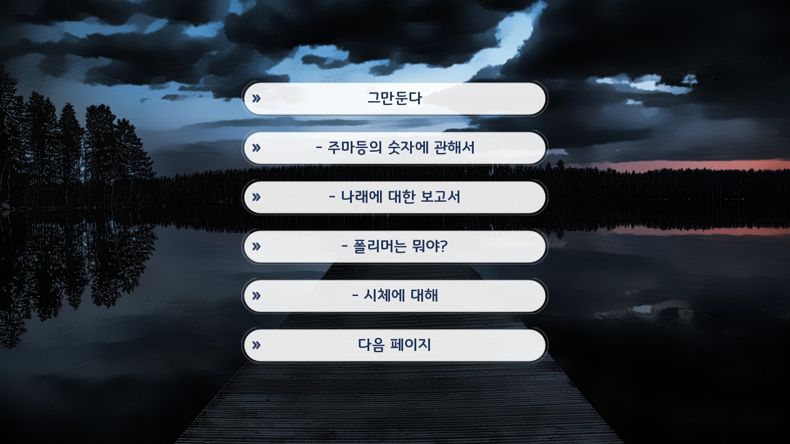

## 소개
진작 했어야 했는데 개발자 콘솔도 꼬이고, 너무 큰 개인 사정이 있어서 이제서야 진행 할 수 있었습니다. 다시 한 번 사과 드립니다.
​
우선 기존 Ren'py로 제작된 게임은 Ren'py 6~7 버전으로 제작 되었으며, 현재 Ren'py 최신 버전은 8 버전입니다.
최신 버전을 사용해야 여러분들의 휴대폰에서 정상적으로 작동되는 최신 SDK 타겟을 설정할 수 있어서 설치 및 플레이가 가능한데요.
최신 타겟 SDK에 맞추지 않으면 구글 플레이에 등록 된 게임도 검색 및 설치가 불가능 합니다.
​
그렇다면 최신 버전의 Ren'py로 만들면 되는 거 아니냐고 물을 수 있는데, 그렇게 하면 됩니다. 생각보다 쉽죠?
문제는 Ren'py가 발전해나가며 자체 엔진도 변화 되었고, 그 변화에 맞추지 못한 기존 게임에 문제가 다발적으로 발생하여 버그를 수정한다고 꽤 시간이 걸렸습니다.
​
우선 기존의 게임을 분류하면 이렇게 됩니다.
​
## 업데이트 되는 게임 목록

- 너무 구버전이라 여러가지를 뜯어고침 (Ren'py 6으로 개발)
Project2 - Time Travelers
Project6 - 저편 하늘을 향해 EP1~2
Agatha Proejct4 - 가장 사랑스러운 너에게 축복을!
​
- 구버전이라 적당히 뜯어고침 (Ren'py 6 베이스에 7을 덮어씌워 개발)
Project4 Remake - 우리들의 날개는 언제부턴가 부서졌다 Fragments
Project10 - 나의 교육과정에 마법 과목이 추가되었다 EP1
Project12 - 칸타빌레 레시피
Project13 - 마녀와 고양이의 아스피레이션
Project14 - 우리들의 날개는 언제부턴가 사라졌다 EP1
Project14 - 우리들의 날개는 언제부턴가 사라졌다 EP2
​
- 구버전이지만 내부 모듈이 호환되지 않아 적당히 고침 (Ren'py 6 베이스에 7 베이스를 섞어 개발)
Project1 Remake - 적마도사 미궁 대모험
Project17 - 어떻게 봐도 내 인생은 너무 불행하다 EP2
Project17 sub2 - 어떻게 봐도 내 인생은 너무 불행하다 EP2 아이오 프린세스
Project20 - 잊혀진 숲의 아이들
Project22 - 아스라이 커뮤니케이션
​
- 구버전이지만 내부 모듈이 호환되지 않아 적당히 고침 (Ren'py 7로 개발)
Project23 - Alive 2020
​
- 개발완료 (Ren'py 8로 개발)
Project26 - 그X그녀의 계획은 훼방X훼방
​
- 개발중 (Ren'py 8로 개발)
Project25 Remake - 유나의 마음 가져오기 대작전 (가칭)
​
## 주요 변경점

비교하면 이런 느낌 (왼쪽이 구 버전)
보기 불편한 대사창은 수정 되어서 다시 적용 시켰습니다.
일부 프로젝트, 그리고 초창기에 개발했던 작품이 이에 해당합니다.
​
기존 프로젝트 중 보기 힘든 대사창도 모두 수정 되었음
더불어 게임 내에 탑재 된 글꼴을 나눔고딕, 나눔명조에서 "경기천년제목" 혹은 "경기천년바탕 700"으로 변경 되었습니다.
경기천년제목은 모바일 게임을 하는 사람이라면 익숙한 글꼴일텐데요, 그만큼 글꼴 가독성이 높고 보기에 편합니다.
현재 발매된 '그X그녀의 계획은 훼방X훼방'에 적용된 글꼴이 경기천년제목입니다.
​
​
오른쪽 처럼 나오게 수정 됨 (왼쪽은 버그)
강제로 Ren'py 8 버전을 적용 시켜 생긴 버그 중에 하나인 선택지에서 등장하는 대사창입니다.
선택지 화면에서 대사창이 나오는데, "강제로 끄는 방법" 혹은" 유지한채로 대사창 닫기 키를 적용하는 방법" 중에 고민을 하다가 자연스럽게 해결할 수 있는 방법을 찾게 되었습니다.
​
더불어 선택지에서 모든 UI가 사라져서 저장/불러오기 버튼을 삽입 시켰는데, 이젠 UI가 사라지지 않아 굳이 버튼을 추가할 필요는 없었지만, 굳이 삭제 할 필요도 없을 것 같아 일단 유지시켰습니다.
​
​
개인적으로 이해 안가는 UX (왼쪽이 구 버전)
Ren'py 7 버전까지는 전환 키를 통해 빠르게 접근 가능한 퀵 메뉴가 존재했었는데요
​
불편하다고 생각해서 하단에 UI를 모아두었습니다. 방해가 되지 않게 UI를 잠깐 숨기는 기능도 존재하기에 기존과 크게 다른 경험은 없을 거라 생각합니다.
사실 저것도 유쾌한 UX는 아니라서 문제가 많긴 하지만, 하나 하나 고치게 되면 Ren'py 최신 버전 업데이트 일자가 늦어지기만 할 것 같아 일단 저렇게 마무리 지었습니다.
​
​
백로그 최신화, (왼쪽이 구 버전)
강제로 Ren'py 최신 버전을 삽입 시킨 결과 백로그에서 오류가 다발적으로 발생해서 정상적으로 실행 시킬 수가 없었습니다.
새로 만들어서 새로 넣었습니다.
스크롤 할 때 렉이 우다다다 생기는 문제가 있어서 이 부분도 함께 해결했습니다.
​
​

*좀 더 보기는 편해졌다 정도*
프로젝트 2를 켰는데 선택지 화면이 부담스럽더라고요.
프로젝트 26의 UI 가져와서 다시 만들어서 넣었습니다.
​
​
이제 정상적으로 출력 됩니다. (왼쪽이 버그)
Ren'py 내에 탑재된 Python도 버전이 달라졌는데요, 내부에서 점수 계산 시 활용하던 함수가 제대로 작동이 안되었습니다. 모두 수정되었습니다.
​
시나리오 진행도 시스템도 이제 정상적으로 나옴
설정 창에서 확인할 수 있는 점수 UI도 모두 정상적으로 작동합니다.
​
​
저장할 때 어디에서 저장했는지 확인이 가능
대부분의 기존 프로젝트는 저장할 때 이미지 파일을 정말 작게 저장되어서 어디에서 저장했는지 확인하기가 불편했는데요
저장할 때 적어도 어떤 챕터인지는 구분할 수 있게 save_name을 추가하였습니다.
챕터명이 자세하게 있던 프로젝트는 그대로 삽입하였으며, 없는 것은 챕터명만 간략하게 들어갔습니다.
​
을(를)이 이제 안 나옴
받침 유무 확인해서 을(를)이 아닌 적재적소에 맞게 조사가 붙게 수정되었습니다.
글꼴 파일을 사용해서 버튼이 출력 되도록 수정하였습니다.
소수점이 엉망진창으로 나오는 버그가 수정되었습니다.
일부 보기 어려운 문자가 보기 좋게 수정되었습니다.
​
​
보기 불편한 아이콘도 모두 수정되었습니다.
​
​
## 여담

플레이를 하다보면 고치고 싶었던 게 정말 많았는데요. 그럼에도 불구하고 최대한 건드리지 않는 형태로 심각만 문제만 고치는 방향으로 잡았습니다.
​
업데이트는 최대한 테스트 해보고 버그 없이 업데이트를 하고 싶어, 오는 "3월 1월" 일괄 업데이트 될 예정입니다.
그럼에도 불구하고 버그가 생길 수 있어, 리포트가 발생한다면 언제든지 문의를 보내주세요. (문의 바로가기)